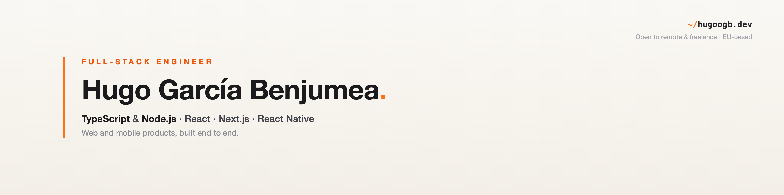

<!-- Banner -->
<a href="https://hugoogb.dev">
  
</a>

<div align="center">

<!-- Animated tagline -->
<a href="https://hugoogb.dev">
  
</a>

<br />

<a href="https://hugoogb.dev"></a>
<a href="https://www.linkedin.com/in/hugoogb/"></a>
<a href="mailto:hugogaben8.02@gmail.com"></a>

<a href="https://github.com/hugoogb?tab=followers"></a>

</div>

---

### `whoami`

```ts
const hugo: FullStackEngineer = {
  location: "Barcelona, EU 🇪🇺",
  role: "Full-Stack Engineer",
  stack: ["TypeScript", "Node.js", "React", "Next.js", "React Native"],
  currently: "building SaaS platforms end to end @ Camaleonic Analytics",
  focus: "shipping complete web & mobile products — from data model to UI",
  openTo: ["remote roles", "freelance / self-employed"],
  timezones: ["EU", "US overlap"],
};
```

I build web and mobile applications the whole way through — the data model, the API, and the
interface people actually use. I like owning a problem end to end rather than a single slice of it,
and I'm most at home in **TypeScript** and **Node.js**.

Right now I'm open to **remote roles** and **freelance work** across EU and US time zones.

---

### 🧰 Tech I build with

**Languages**


**Frontend & Mobile**


**Backend & Data**


**Tooling & Infra**


---

### 🚀 Featured work

| Project | What it is | |
| :--- | :--- | :--- |
| **[F1 Tracker](https://f1-tracker-web.vercel.app)** | The complete history of Formula 1 as an interactive analytics dashboard — Next.js + Tailwind on a FastAPI/PostgreSQL backend, fed by a Python data pipeline. | [](https://github.com/hugoogb/f1-tracker/actions/workflows/ci.yml)<br>[Live ↗](https://f1-tracker-web.vercel.app) · [Code](https://github.com/hugoogb/f1-tracker) |
| **[ReadLedger](https://readledger.app)** | A manga collection tracker with reading, spending and second-hand savings analytics — Next.js, Supabase, Prisma. | [Live ↗](https://readledger.app) · [Code](https://github.com/hugoogb/readledger) |
| **[@avatar-generator](https://github.com/hugoogb/avatar-generator)** | A framework-agnostic avatar-generation library, published to npm. | [](https://www.npmjs.com/package/@avatar-generator/core) [](https://www.npmjs.com/package/@avatar-generator/core)<br>[Code](https://github.com/hugoogb/avatar-generator) |
| **3D PV Designer** _(Wattwin)_ | Degree project: a 3D photovoltaic designer with a ray-tracing shadow engine that recalculates in real time over WebSockets. | [Case study ↗](https://hugoogb.dev) |

More on **[hugoogb.dev](https://hugoogb.dev) →**

---

<div align="center">

### 📫 Let's build something

I'm open to **remote roles** and **freelance / self-employed** work — happy to work from anywhere,
across EU and US time zones.

**[hugoogb.dev](https://hugoogb.dev)** · **[LinkedIn](https://www.linkedin.com/in/hugoogb/)** · **[hugogaben8.02@gmail.com](mailto:hugogaben8.02@gmail.com)**

</div>
