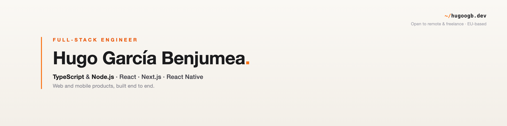

<!-- Banner -->

<!-- Animated tagline -->

 

---

### 📫 Let's build something

I'm open to **remote roles** and **freelance / self-employed** work — happy to work from anywhere,
across EU and US time zones.

**[hugoogb.dev](https://hugoogb.dev)** · **[LinkedIn](https://www.linkedin.com/in/hugoogb/)** · **[hugogaben8.02@gmail.com](mailto:hugogaben8.02@gmail.com)**

